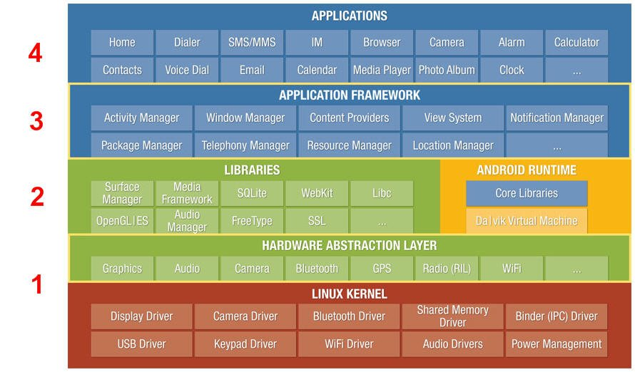

# Day 1 / Disclaimer
Lot of information have been copied from
* https://developer.android.com/training/index.html
* http://www.vogella.com/tutorials/Android/article.html
* https://developer.android.com/reference/packages.html

# Android
Android is an operating system based on the Linux kernel.
This Android operating system can be divided into the four areas:

 * Applications - The Android Open Source Project contains several default application, like the Browser, Camera, Gallery, Music, Phone and more.
 * Application framework - An API which allows high-level interactions with the Android system from Android applications.
 * Libraries and runtime - The libraries for many common framework functions, like, graphic rendering, data storage, web browsing. It also contains the Android Runtime, as well as the core Java libraries for
   running Android applications.
 * Linux kernel - Communication layer for the underlying hardware.



An Android application developer typically works with the first two areas to create new Android applications.

Android is published in different version, each one supporting a different version of the API.
For example 
Marshmallow 6.0 supports applications that require API <= 23,
Lollipop 5.1 supports applications that require API <= 22, and
KitKat 4.4  supports applications that require API <= 19.
That is, if you application requires some functionality that has been introduced in API 22,
it will be able to run Marshmallow and Lollipop, but not on KitKat.

## How to develop Android applications
Android applications are primarily written in the Java programming language.
During development the developer creates the Android specific configuration files and writes the application logic in the Java programming language.

The Android development tooling converts these application files into an Android application. If the developer trigger the deployment, the whole Android application is compiled, packaged, deployed and potentially started.

## Android Developer Tools and Android Studio

Google provides an IDE called Android Studio as the preferred development environment for creating Android applications.
This IDE is based on the IntelliJ IDE and can be downloaded for free from https://developer.android.com/studio/index.html

The Android tools provide specialized editors for Android specific files.
Most of Android’s configuration files are based on XML (We will see later what XML is).
In this case these editors allow you to switch between the XML representation of the file and a structured user interface for entering the data.

To install Android Studio follow the guide at https://developer.android.com/studio/install.html
* Chose to install the Standard configuration (the installer will download the needed components)

# Creating an Android Project
refer to https://developer.android.com/training/basics/firstapp/creating-project.html

To create a new Android project with Android Studio

1. In Android Studio, create a new project:
 * If you don't have a project opened, in the Welcome to Android Studio window, click Start a new Android Studio project.
 * If you have a project opened, select File > New Project.
2. In the New Project screen, enter the following values:
 * Application Name: "My First App"
 * Company Domain: "example.com"
3. Android Studio fills in the package name and project location for you, but you can edit these if you'd like. Click **Next**.
4. In the Target Android Devices screen, keep the default values and click Next.
 * The Minimum Required SDK is the earliest version of Android that your app supports, which is indicated by the API level. To support as many devices as possible, you should set this to the lowest version available that allows your app to provide its core feature set. If any feature of your app is possible only on newer versions of Android and it's not critical to the core feature set, enable that feature only when running on the versions that support it (see Supporting Different Platform Versions).
5. In the Add an Activity to Mobile screen, select Empty Activity and click Next.
6. In the Customize the Activity screen, keep the default values and click Finish. 

After some processing, Android Studio opens and displays a "Hello World" app with default files. You will add functionality to some of these files in the following lessons.
Now take a moment to review the most important files. First, be sure that the Project window is open (select View > Tool Windows > Project) and the Android view is selected from the drop-down list at the top.

There are usually two type of files in an Android application:
 * Java source files, used to write the source code of your application
 * XML files, used for everything else: e.g. to specify the graphical layout of your app,
   put buttons and labels, etc etc.
Before giving a look to the files that constitute your first app we need to introduce XML files.

# Intro to XML
XML stands for eXtensible Markup Language.
An XML document is a string of characters and is mainly used to represent 
a tree structure, for example
```XML
<catalog>
 <book pages="125">
  <author>Roberto Guanciale</author>	
  <title>First Android Lecture</title>	
 </book>
 <book pages"1016" year="2026">
  <author>Galileo Galilei</author>	
  <title>The Scientific Method</title>	
 </book>
 <book year="">
  <author>Newton</author>	
  <title>The Scientific Method</title>
  <publisher name="Springer" country="Germany"/>
 </book>
</catalog>
```
is an XML document representing a catalog of three books.

XML is closely related to HTML and has been developed to
be extensible.

## Tags
A tag is a construct that begins with `<` and ends with `>`. Tags come in three flavors:
* start-tag, such as `<catalog>`, `<book>`
* end-tag, such as `</catalog>`, `</book>`
* empty-element tag, such as `<publisher />`

## Elements
An element is a logical document component that either begins with a start-tag and ends with a matching end-tag (or consists only of an empty-element tag).
The characters between the start-tag and end-tag, if any, are the element's content, and may contain markup, including other elements, which are called child elements.
Some examples:
* `<author>Roberto Guanciale</author>` is an element, its content is `Roberto Guanciale`
* `<title>The Scientific Method</title>` is an element, its content is `The Scientific Method`
* `<book pages="125">
  <author>Roberto Guanciale</author>	
  <title>First Android Lecture</title>	
 </book>` is an element. it has two children: `<author>Roberto Guanciale</author>` and `<title>First Android Lecture</title>`.
* the whole XML document is an element, usually called root. It contains three children.


## Attributes
An attribute is a construct consisting of a name–value pair that exists within a start-tag (or empty-element tag).
An example is `<book pages"1016" year="2026">`, where the name of the attributes are "pages" and "year" and their values are "1016" and "2026" respectively.
An XML attribute can only have a single value and each attribute can appear at most once on each element. In the common situation where a list of multiple values is desired, this must be done by encoding the list into a well-formed XML attribute with some format beyond what XML defines itself. Usually this is either a comma or semi-colon delimited list or, if the individual values are known not to contain spaces,a space-delimited list can be used. 

## Resources
- [w3schools.com XML Tutorial](http://www.w3schools.com/xml/)


# Content of the minimal Android App
Now take a moment to review the most important files created by Android Studio.
Be sure that the Project window is open (select View > Tool Windows > Project) and the Android view is selected from the drop-down list at the top.
You can then see the following files:

* `app > java > com.example.myfirstapp > MainActivity.java`
    This file appears in Android Studio after the New Project wizard finishes. It contains the class definition for your application.
    When you build and run the app, the MainActivity starts says "Hello World!"
* `app > res > layout > activity_main.xml`
    This XML file defines the graphical interface of your application. For now it just contains the text "Hello world!".
* `app > manifests > AndroidManifest.xml`
    This XML file describes the fundamental characteristics of the app and is used by Android to understand how start your application.
* `Gradle Scripts > build.gradle`
    Android Studio uses Gradle to compile and build your app. There is a `build.gradle` file for each module of your project, as well as a build.gradle file for the entire project.

An Android application (short: Android app) is a single installable unit which can be started and used independently of other Android applications.
An Android application consists of Android components, Java source and resource files. For now, it is enough to know the following Android components:

* Application: An Android application can have one Application class which is instantiated before any other Android component. It is the last component which is stopped during application shutdown.
  If not explicitly defined, Android creates a default application object for your application. (this is the case for our app)
* Activity (e.g. `MainActivity.java`): An activity is the visual representation of an Android application. An Android application can have several activities.
  Activities use views and fragments to create their user interface and to interact with the user.

Our simple application has only one activity: `MainActivity.java`.

To run the app, continue to the next lesson. 

## Running Your App
https://developer.android.com/training/basics/firstapp/running-app.html

You can now run the app on an emulator. 
Before you run your app on an emulator, you need to create an Android Virtual Device (AVD) definition.
An AVD definition defines the characteristics of an Android phone, tablet that you want to simulate in the Android Emulator.

Create an AVD Definition as follows:

1. Launch the Android Virtual Device Manager by selecting Tools > Android > AVD Manager.
2. In the Your Virtual Devices screen, click Create Virtual Device.
3. In the Select Hardware screen, select a phone device, such as Nexus 5, and then click Next.
4. In the System Image screen, choose the desired system image for the AVD and click Next.
 * Since you don't have a particular system image installed, you can get it by clicking the download link.
   Basically, you are donwloading a virtual machine able to run the selected version of Android
5. Verify the configuration settings (for your first AVD, leave all the settings as they are), and then click Finish.


Run the app from Android Studio as follows:

1. In Android Studio, select your project and click Run  from the toolbar.
2. In the Select Deployment Target window, select your emulator and click OK.
 * The fist time you execute the application (i.e. run the virtual machine), Android Studio downloads a version of Android
   compatible with your virtual machine and the API level specified.

It can take a few minutes for the emulator to start. You may have to unlock the screen. When you do, My First App appears on the emulator screen.
Notice that you are not running only your application: you are running a complete version of Android in the emulator.

1. Go on the Home-screen of your emulate phone and play around (i.e. use the Browser)
2. Re-execute you application using the Android interface
3. Close your application
4. Re-execute you application using clicking Run  from the toolbar of Android Studio.
   Notice that this time the application start faster, since the complete Android has not to be booted.
5. Close the Android Emulator
6. Re-execute the emulator using Tools > Android > AVD Manager and clicking the run button. Notice that your application is still installed.

That's how you build and run your Android app on the emulator! To start developing, continue to the next lesson.


# Modifying the Simple User Interface
Open `MainActivity.java`. This is the visual representation of the Android application and is currently the only
Activity we have. When the activity starts, it executes
```Java
setContentView(R.layout.activity_main);
```
This method, inform the Android runtime to draw the graphical interface `R.layout.activity_main`.
Where `R.layout.activity_main` is defined? 
It is not directly defined in Java. Like several components in an Android application, `R.layout.activity_main`
is defined via an XML file: `res/layout/activity_main.xml`. These resources are transformed *atumatically* by
the Android development environment to Java files, that you never manipulate manually.
The reason behind this design choice is that it is easier to build tools that manipulate XML files that Java code.
Also, since XML is extensible, the same format can be used to speficy different traits of you application 

* Layout of the graphical interface, position of buttons, text areas, menus etc.
* Configurations, translation of string in different languages, etc

Java is instead used to specify the logic (behavior) of the app.

Open `res/layout/activity_main.xml`. Android Studio opens a specialized graphical editor to design Android interfaces.
This editor is able to manipulate XML files that describe activityes's layouts.
By clicking on the *design* and *text* tabs, you can switch between a graphical representation of the laout and its
original XML definition:
```XML
<?xml version="1.0" encoding="utf-8"?>
<RelativeLayout xmlns:android="http://schemas.android.com/apk/res/android"
    xmlns:tools="http://schemas.android.com/tools"
    android:id="@+id/activity_main"
    android:layout_width="match_parent"
    android:layout_height="match_parent"
    android:paddingBottom="@dimen/activity_vertical_margin"
    android:paddingLeft="@dimen/activity_horizontal_margin"
    android:paddingRight="@dimen/activity_horizontal_margin"
    android:paddingTop="@dimen/activity_vertical_margin"
    tools:context="com.example.guancio.myapplication.MainActivity">
    <TextView
        android:layout_width="wrap_content"
        android:layout_height="wrap_content"
        android:text="Hello World!" />
</RelativeLayout>
```
The graphical user interface for an Android app is built using a hierarchy of `View` and `ViewGroup` objects.
`View` objects are usually UI widgets such as buttons or text fields.
`ViewGroup` objects are invisible view containers that define how the child views are laid out, such as in a grid or a vertical list.


Layouts are subclasses of the `ViewGroup`. In this example, the interface of the application consists of `RelativeLayout` which
contains one single `View` object: a `TextView`.
The `TextView` element has the attribute `android:text` which specifies the string printed by the UI component.
Change the string to something else and re-execute (re-deploy) the application using 
 from the toolbar.

Alternatively, you can change the text using the design view.

 1. Select the `TextView` from the component tree or by clicking the text
    in the graphical interface
 2. Change the `text` field in the `Properties`	panel
 3. Re-deploy the application.

We can change other properties of the `TextView`

 1. expand the textApparance section
 2. change the textSize to `22sp`
 3. switching to the text view of the editor we can notice that a new attribute as been added to the `TextView` element: `android:textSize="25sp"`


# Using layout managers
A layout manager is responsible for layouting itself and its child `Views` It is a subclass of `ViewGroup`.
Android supports different default layout managers.

The most relevant layout managers in Android are: LinearLayout, FrameLayout, RelativeLayout and GridLayout.

## Frame layout
`FrameLayout` is a layout manager which draws all child elements on top of each other.

## LinearLayout
`LinearLayout` puts all its child elements into a single column or row depending on the `android:orientation` attribute. Possible values for this attribute are `horizontal` and vertical. `horizontal` is the default value.

If `horizontal` is used, the child elements are layouted as indicated by the following picture.


`Vertical` would result in a layout as depicted in the following picture.


`LinearLayout` can be nested to achieve more complex layouts.

`LinearLayout` supports assigning a weight to individual children via the `android:layout_weight` layout parameter. This value specifies how much of the extra space in the layout is allocated to the corresponding view. If, for example, you have two widgets and the first one defines a `layout_weight` of 1 and the second of 2, the first will get 1/3 of the available space and the other one 2/3. You can also set the `layout_weight` to zero to always have a certain ratio.

## RelativeLayout

`RelativeLayout` allows positioning the widget relative to each other. This can be used for complex layouts. `RelativeLayout` is a complex layout manager and should only be used if such a complex layout is required, as it performs a resource intensive calculation to layout its children.

A simple usage for RelativeLayout is if you want to center a single component. Just add one component to the RelativeLayout and set the `android:layout_centerInParent` attribute to `true`.

## Excercise: display a text entry and a button
Our goal is to show a text field and a button in a single row.

Open the activity resource (`activity_main.xml`) and select the `Text` view.
Delete completely the content and write the following code
```XML
<?xml version="1.0" encoding="utf-8"?>
<LinearLayout
    xmlns:android="http://schemas.android.com/apk/res/android"
    xmlns:tools="http://schemas.android.com/tools"
    android:layout_width="match_parent"
    android:layout_height="match_parent"
    android:orientation="horizontal">
</LinearLayout>
```
`LinearLayout` is a view group (a subclass of `ViewGroup`) that lays out child views in horizontal orientation (as specified by the `android:orientation` attribute). Each child of a LinearLayout appears on the screen in the order in which it appears in the XML.

Two other attributes, android:layout_width and android:layout_height, are required for all views in order to specify their size.

Because the LinearLayout is the root view in the layout, it should fill the entire screen area that's available to the app by setting the width and height to `"match_parent"`. This value declares that the view should expand its width or height to match the width or height of the parent view.

In the `activity_main.xml` file, within the `<LinearLayout>` element, add the following `<EditText>` element:
```XML
<LinearLayout
    xmlns:android="http://schemas.android.com/apk/res/android"
    xmlns:tools="http://schemas.android.com/tools"
    android:layout_width="match_parent"
    android:layout_height="match_parent"
    android:orientation="horizontal">
    <EditText android:id="@+id/edit_message"
        android:layout_width="wrap_content"
        android:layout_height="wrap_content"
        android:hint="Write here your message" />
</LinearLayout>
```

Here is a description of the attributes in the `<EditText>` you added:
* `android:id`
    This provides a unique identifier for the view, which you can use to reference the object from your app code, such as to read and manipulate the object (you'll see this in the next lesson).
  * The at sign (@) is required when you're referring to any resource object from XML. It is followed by the resource type (id in this case), a slash, then the resource name (edit_message).
  * The plus sign (+) before the resource type is needed only when you're defining a resource ID for the first time. When you compile the app, the SDK tools use the ID name to create a new resource ID in your project's `R.java` file that refers to the `EditText` element. With the resource ID declared once this way, other references to the ID do not need the plus sign. Using the plus sign is necessary only when specifying a new resource ID and not needed for concrete resources such as strings or layouts.
* `android:layout_width` and `android:layout_height`
    Instead of using specific sizes for the width and height, the "wrap_content" value specifies that the view should be only as big as needed to fit the contents of the view. If you were to instead use "match_parent", then the EditText element would fill the screen, because it would match the size of the parent Linear
* `android:hint`
    This is a default string to display when the text field is empty.
    
Add a button after the `<EditText>`. Your file should look like this:
```XML
<LinearLayout
    xmlns:android="http://schemas.android.com/apk/res/android"
    xmlns:tools="http://schemas.android.com/tools"
    android:orientation="horizontal"
    android:layout_width="match_parent"
    android:layout_height="match_parent">
        <EditText android:id="@+id/edit_message"
          android:layout_width="wrap_content"
          android:layout_height="wrap_content"
          android:hint="Write here your message" />
        <Button
          android:layout_width="wrap_content"
          android:layout_height="wrap_content"
          android:text="Click here" />
</LinearLayout>
```
Note: This button doesn't need the android:id attribute, because we are not interested to know any property of the button from the activity code. On the other hand, we need an id for the text field, since we want to read the inserted text and from the activity code and print it.

Try to compile and run the application.

## Adding behavior to you app
You’ll add some code to MainActivity that does something with the text entered by the user.

As common with other frameworks for graphical user interfaces, Android apps
ususally follow  event-driven programming: a programming paradigm in which the flow of the program is determined by events such as user actions (mouse clicks, key presses), sensor outputs, or messages from other apps. 

In an event-driven application, there is generally a *main loop* that listens for events, and then triggers a *callback function* when one of those events is detected. 
Because the code for checking for events and the main loop do not depend on the application, many programming frameworks take care of their implementation and expect the user to provide only the code for the *event handlers*.

In activity_main.xml, assign the name sendMessage to the android:onClick property of your Button:
```Xml
<?xml version="1.0" encoding="utf-8"?>
<LinearLayout
    xmlns:android="http://schemas.android.com/apk/res/android"
    xmlns:tools="http://schemas.android.com/tools"
    android:layout_width="match_parent"
    android:layout_height="match_parent"
    android:orientation="horizontal">
    <EditText android:id="@+id/edit_message"
        android:layout_weight="1"
        android:layout_width="wrap_content"
        android:layout_height="wrap_content"
        android:hint="Write here your message" />
    <Button
        android:layout_width="wrap_content"
        android:layout_height="wrap_content"
        android:onClick="sendMessage"
        android:text="Click here" />
</LinearLayout>
```
This attribute tells the system to call the `sendMessage()` method in your activity whenever a user clicks on the button.
Thus we need to define the sendMessage method, which is the event handler for button's clicks. Open  MainActivity.java and add the sendMessage method:
```Java
public class MainActivity extends AppCompatActivity {
    @Override
    protected void onCreate(Bundle savedInstanceState) {
        super.onCreate(savedInstanceState);
        setContentView(R.layout.activity_main);
    }

    /** Called when the user clicks the Send button */
    public void sendMessage(View view) {
        // Do something in response to button
    }
}
```

(p.s. import `import android.view.View;` if needed).
In order for the system to match this method to the method name given to `android:onClick`, the signature must be exactly as shown. Specifically, the method must:
 * Be public
 * Have a void return value
 * Have a `View` as the only parameter (this will be the View that was clicked)

Next, you’ll fill in this method to read the contents of the text field and do something meaningful.

## Showing a message / popup
A toast provides simple feedback about an operation in a small popup. It only fills the amount of space required for the message and the current activity remains visible and interactive. For example, navigating away from an email before you send it triggers a "Draft saved" toast to let you know that you can continue editing later. Toasts automatically disappear after a timeout.

First, instantiate a Toast object with one of the makeText() methods. This method takes three parameters: the application `Context` (for now this is the Activity itself), the text message, and the duration for the toast. It returns a properly initialized Toast object. You can display the toast notification with show(), as shown in the following example:

```Java
public class MainActivity extends AppCompatActivity {
    @Override
    protected void onCreate(Bundle savedInstanceState) {
        super.onCreate(savedInstanceState);
        setContentView(R.layout.activity_main);
    }

    /** Called when the user clicks the Send button */
    public void sendMessage(View view) {
        Toast toast = Toast.makeText(this, "Button pressed", Toast.LENGTH_SHORT);
        toast.show();
    }
}
```
Compile, run the application and try to press the button.

## Display text from your EditText field
To read the content of the text field, we first need to get a reference to the corresponding object.
This is done using `EditText input = (EditText) findViewById(R.id.edit_message);`
* `R.id.edit_message` is a field of the Java file generated from the resource XML file. This field is set by the Android framework to a unique number that represent the View whose id is edit_message (i.e. our EditText field).
* `findViewById` is a method of the Activity supercalls that takes an id and yields a reference to the corresponding View object
* statically, fiendViewById does not know the type of the View, so we need to explicitly case the result to a EditText object

Once we get a reference to the EditText, we can extract the content of the widget using `input.getText().toString();`. The resulting code is
```Java
public class MainActivity extends AppCompatActivity {

    @Override
    protected void onCreate(Bundle savedInstanceState) {
        super.onCreate(savedInstanceState);
        setContentView(R.layout.activity_main);
    }

    public void sendMessage(View view) {
        EditText input = (EditText) findViewById(R.id.edit_message);
        String message = input.getText().toString();
        Toast toast = Toast.makeText(this, message, Toast.LENGTH_SHORT);
        toast.show();
    }
}
```

Excercise, add a third button that sets the TextField to the current date of the system.
```Java
    public void setDate(View view) {
        EditText input = (EditText) findViewById(R.id.edit_message);
        String message = new SimpleDateFormat("yyyyMMdd_HHmmss").format(Calendar.getInstance().getTime());
        input.setText(message);
    }
```

# Debugging
Try to add breakpoints to your program, run your program in debug mode,
inspect the value of local variables and step the program.

